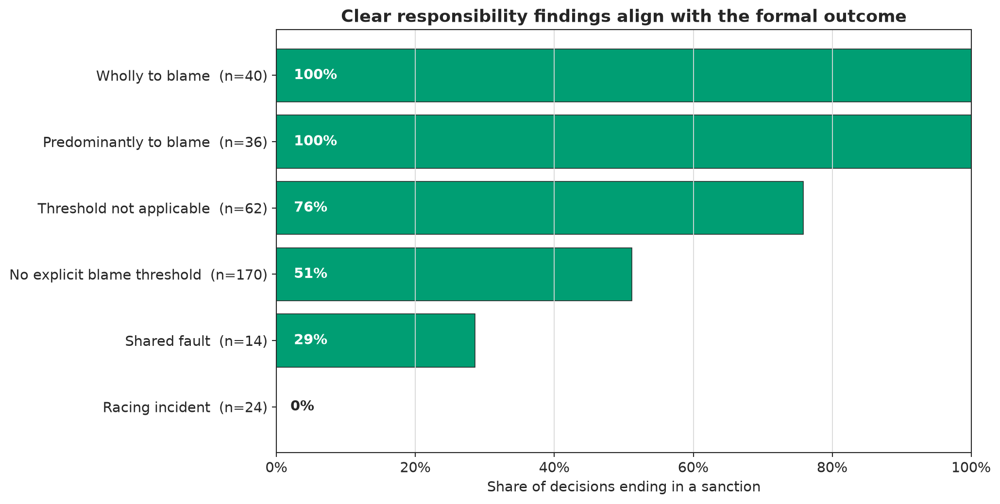
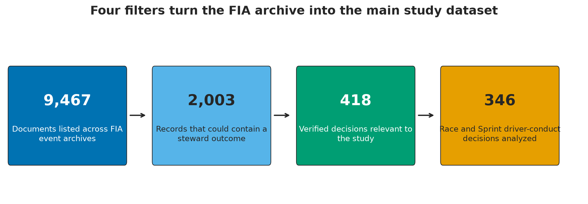

# How Consistent Is Formula 1 Stewarding?

An evidence-linked data analysis of fault, penalties, race consequences, and nationality claims in
Formula 1 stewarding decisions from 2018 through 2025.

[Read the code-free report](reports/the_cost_of_discretion_study_v2.html) |
[Open the executable notebook](notebooks/12_study_v2_report.ipynb) |
[Review the report guide](reports/README.md) |
[Inspect the completion audit](reports/generated/study_v2/completion_audit.csv)

## The question

Formula 1 fans often compare two incidents and ask why one driver received a penalty while another
did not. A replay can make the incidents look similar, but the written decisions may use different
facts, fault thresholds, or mitigating circumstances.

This project tests whether the public FIA record shows a consistent path from the conduct described
by the stewards, to the finding of responsibility, to the final sanction. Incident harm, realized
penalty cost, and nationality claims are analyzed separately so that one type of difference is not
mistaken for another.

## TL;DR

Formula 1 stewarding is consistent after a clear responsibility finding, but meaningfully
inconsistent near the point where responsibility is assigned. All 100 decisions at the clearest
ends of the fault scale aligned with their formal outcomes. Among 317 decisions with enough close
comparison cases, 131 (41.3%) had a different direct-penalty outcome than the nearest match, and 87
of those 131 differences began with a different written fault finding.

The 41.3% result is a review rate, not a stewarding error rate. Some differences may be justified by
incident details that are missing from the structured public data. The evidence supports a focused
claim about uneven judgment at the responsibility boundary, not a claim that the full stewarding
system is arbitrary.

## Main findings

| Question | Evidence | Result |
|---|---|---|
| Do written fault findings align with formal outcomes? | 76 of 76 clear blame findings led to sanctions; 24 of 24 racing-incident findings led to no further action | Strong internal alignment |
| Can incident type and season explain the outcome? | Event-grouped ROC AUC 0.558; Brier improvement 0.0005 | Broad labels add little predictive value |
| Do the closest available cases receive the same direct-penalty outcome? | 186 of 317 matched cases agreed; 131 differed | Meaningful variation that requires case review |
| Where do the matched differences begin? | 87 of 131 had different written fault findings | Responsibility assessment is the main source of variation |
| Do 2025 sanctions follow public guidance? | 21 of 33 plainly matched; seven fit with context; five needed more explanation | Most sanctions fit the public starting point |
| Are penalties proportional to incident harm? | No case had complete fault, harm, and realized-cost evidence | Population-level conclusion withheld |
| Do the data support British-driver favoritism? | 25 of 44 British cases sanctioned versus 189 of 302 other cases; power below 80% | Inconclusive |



## Building the dataset

The FIA event archive contains classifications, summonses, technical reports, corrected decisions,
and multiple versions of the same document. Each archive entry therefore could not be treated as one
stewarding decision.

The source review narrowed the archive in four stages:

1. **9,467 FIA event files** collected across 173 completed championship events.
2. **2,003 possible outcome records** retained after title and document screening.
3. **418 source-verified decisions** retained in the selected primary and supporting categories.
4. **346 Race and Sprint driver-conduct decisions** used in the main analysis across 131 events.

The other 72 verified decisions concern qualifying impeding and remain separate from the primary
sanction rate. One primary row represents one accused driver in one formal decision. Multi-car harm
is stored in a separate participant-level table so that one driver's retirement does not overwrite
another driver's puncture, repair stop, or time loss.



## Analysis design

The analysis follows the decision process instead of compressing fairness into one score.

1. **Describe the published decisions.** Sanction rates are compared by incident family and season,
   with Wilson confidence intervals used to show uncertainty.
2. **Test internal alignment.** Written responsibility language is compared with the formal outcome.
3. **Measure the value of broad labels.** Event-grouped validation tests whether incident family,
   season, and multi-car status reproduce outcomes outside the training events.
4. **Compare similar cases.** Outcome-blind nearest-neighbor matching uses session, guideline era,
   first-lap status, weather, restarts, overlap, and attacker line without using the later fault
   finding or penalty.
5. **Investigate different outcomes.** The written fault finding is restored after matching, and
   selected controversies are checked against their official FIA documents.
6. **Separate sanction from consequence.** Nominal penalties, realized race cost, and participant
   harm remain distinct analytical layers.
7. **Apply release gates.** Findings are withheld when source coverage, sample size, statistical
   power, or independent review is not sufficient.

## What the project adds

### Close-case consistency audit

The closest matched decision had the same direct-penalty outcome in 186 of 317 supported cases
(58.7%) and a different outcome in 131 cases (41.3%). The different outcomes were then separated
into 87 pairs with different written fault findings, 30 pairs with no explicit fault threshold in
either ruling, and 14 pairs involving off-track advantage context.

### Public guideline comparison

Thirty-three sanctions from 2025 could be compared with a published FIA starting point. Twenty-one
(63.6%) plainly matched, seven (21.2%) fit after context or mitigation was considered, and five
(15.2%) required more explanation for a substitution or escalation. The 2025 guidance is never
applied retrospectively to earlier seasons.

### Penalty cost and incident harm

The consequence layer groups 233 collision decision rows into 193 distinct incidents and 412
driver-specific harm records. Only 28 records (6.8%) contained enough same-lap teammate data for a
timing screen. These screens identify cases for source review but do not prove damage because tyres,
traffic, strategy, weather, and hidden car conditions remain alternative explanations.

### Nationality diagnostic

British accused drivers received sanctions in 25 of 44 decisions (56.8%), compared with 189 of 302
decisions for other drivers (62.6%). The British sample falls below the prespecified minimum of 98,
and simulated power for the planned 15-point difference remains below 80%. The correct conclusion is
inconclusive, not evidence of favoritism and not proof that nationality has no effect.

## Evidence boundaries

- The dataset contains published decisions, not every comparable act that occurred on track.
- A different matched outcome is a review candidate, not a confirmed stewarding error.
- Timing changes are not treated as proof of damage, causation, or fault.
- In-race penalties cannot be reconstructed by subtracting nominal seconds from the final result.
- The full source audit is model-led and is not presented as independent human double-coding.
- The nine-decision consequence pilot received separate independent review.
- Individual steward votes are not public, which limits the nationality analysis.
- Missing information remains unknown instead of being converted into zero or no effect.

## Technical stack

- **Analysis:** Python, pandas, NumPy, scikit-learn, SciPy, Matplotlib, Jupyter
- **Data:** DuckDB SQL, partitioned Parquet, FastF1 timing and Race Control feeds
- **Validation:** pytest, Ruff, content-addressed artifacts, release-gate audits
- **Portability:** locally validated Snowflake and Snowsight loading and parity package
- **Reporting:** executable notebook, code-free HTML, colorblind-safe figures, direct FIA citations

The Snowflake package demonstrates deployment portability. DuckDB remains the local reproducible
source of truth, and no live Snowflake deployment is claimed.

## Reproduce the report

Python 3.12 is recommended. The supported range is Python 3.11 through 3.13.

```powershell
python -m venv .venv
.venv\Scripts\Activate.ps1
python -m pip install --upgrade pip
python -m pip install -e ".[analysis,dev]"

python scripts/build_study_v2_notebooks.py
python scripts/audit_report_style.py
python scripts/audit_study_v2_completion.py
pytest
```

The notebook build executes notebooks 07 through 12 and exports the code-free HTML report. The
completion audit checks 28 release controls, including source citations, immutable artifacts,
executed notebooks, evidence gates, hidden code, and the final claim ledger. The current test suite
contains 231 passing tests.

## Repository layout

```text
config/       Source registries, review protocols, and release settings
data/         Raw, interim, processed, and content-addressed manual artifacts
docs/         Methods, codebooks, source registers, and review protocols
explorer/     Evidence-linked static review applications
notebooks/    Numbered executable analyses and final report notebook
reports/      Code-free report, figures, claim ledger, and completion audit
snowflake/    Optional Snowsight DDL, loading, quality, and parity worksheets
sql/          Portable schema and analytical queries
src/          Reusable Python package
tests/        Parser, schema, transformation, modeling, and release tests
```

## Primary outputs

- [Final code-free report](reports/the_cost_of_discretion_study_v2.html)
- [Executable final notebook](notebooks/12_study_v2_report.ipynb)
- [Study v2 protocol](docs/study_v2_protocol.md)
- [Model review protocol](docs/model_review_protocol.md)
- [Model validation method](docs/model_validation_method.md)
- [Completion audit](reports/generated/study_v2/completion_audit.csv)
- [Claim ledger](reports/claim_ledger.csv)

Every one of the 418 included primary and supporting decisions has a direct FIA citation in the
final report. The full 920-row source audit preserves evidence passages, correction history, rule
sources, confidence fields, exclusion checks, and review status.

## Author

Brian Zeng |
[brianbzeng.com](https://brianbzeng.com) |
[github.com/brianbzeng](https://github.com/brianbzeng) |
[linkedin.com/in/brianbzeng](https://www.linkedin.com/in/brianbzeng/)

No license has been selected.
