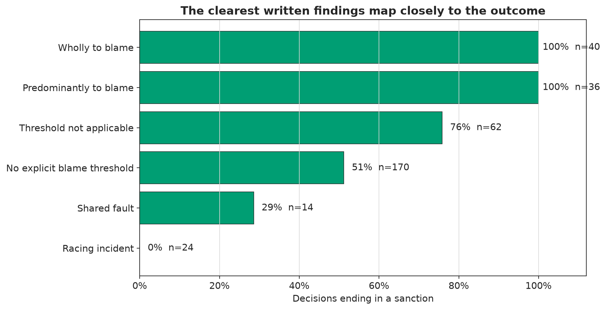
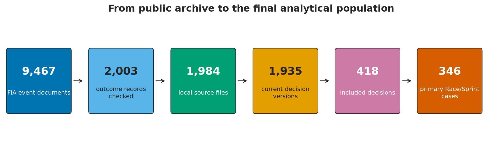

# The Cost of Discretion

## What eight seasons of public evidence can—and cannot—tell us about Formula 1 stewarding

Start with the consolidated [code-free final report](the_cost_of_discretion_study_v2.html). The
same report is available as an [executable Jupyter notebook](../notebooks/12_study_v2_report.ipynb),
where every figure and result is reproduced from the frozen analytical artifacts.

The earlier [v1 oversight report](the_cost_of_discretion.html) and notebooks 00–06 are retained as
project history. The consolidated report combines their pilot, full-corpus, modeling, impact, and
nationality results with the later source audit, referral funnel, incident timing, close-case
matching, and collision-harm work.

## The answer in brief

The public evidence points to a stewarding system that was usually coherent after a written fault
finding, but less predictable at the boundaries. It does not establish systematic unfairness or
national bias, and it does not clear every decision. The deeper inconsistency audit finds changing
or incomplete standards, limited live evidence, thin explanations, and a small number of unresolved
judgment calls. The public record is also incomplete before referral, and full competitive harm is
rarely documented in a common form.

The clearest formal findings were internally coherent: all 76 decisions finding a driver wholly or
predominantly to blame imposed a sanction, while all 24 racing-incident findings ended with no
further action. By contrast, a model based only on incident family, season, and multi-car status
barely ranked outcomes above chance (ROC AUC 0.558).

## What the final report includes

- **346 primary Race/Sprint decisions** across 131 events; 214 resulted in a sanction.
- **418 included decisions and 502 sampled exclusions** in a strict, source-cited GPT-5.6 Sol audit.
- **32 corrected included records** and one FIA citation for every included decision.
- **966 public Race Control referral episodes**, including 177 high-confidence links to a primary
  decision.
- **317 cases with at least five outcome-blind close neighbors**; nearest outcomes matched in 186
  and differed in 131 under a direct sporting-penalty definition. Of those differences, 87 began
  with different written fault findings, 30 had no explicit fault threshold in either ruling, and
  14 involved off-track advantage context.
- **A source-cited controversy audit** covering Canada/Austria 2019, Silverstone, São Paulo and Abu
  Dhabi 2021, Austin/Mexico 2024, and residual rule or reasoning gaps found in the corpus.
- **33 contemporaneous 2025 guideline comparisons**: 21 plainly within guideline, seven within a
  contextual or mitigated range, and five requiring more context for substitution or escalation.
- **A nine-decision independently reviewed impact pilot** showing that identical written seconds
  can produce very different position and points consequences.
- **412 participant-level collision-harm records**, narrowed to 28 estimable timing screens that
  remain research leads rather than confirmed damage effects.
- **An inconclusive nationality diagnostic**: 44 British-accused cases versus the prespecified
  minimum of 98.

## Evidence boundaries

The full-corpus audit is model-led and explicitly disclosed; it is not presented as independent
human double-coding. The impact pilot was independently reviewed. Timing is never treated as proof
of damage, a different close-case outcome is never treated as proof of an error, and the public 2025
guidelines are never applied retrospectively.

The highlighted controversies explain where fan narratives come from, but they are selected case
studies rather than a prevalence sample. Famous examples also cut in different nationality
directions, so they cannot substitute for the gated nationality design.

The proportionality release remains closed because fault, incident-caused harm, and realized
sanction cost are not all confirmed for the same full-corpus cases. Missing information remains
unknown rather than being converted into zero.

## Technical evidence

The project uses tested Python, Jupyter, DuckDB SQL, pandas, FastF1, partitioned Parquet, Git and
GitHub Actions. The repository also contains a locally validated Snowflake/Snowsight deployment
package without claiming that it has been run in a live Snowflake account.

The machine-verifiable [Study v2 completion audit](generated/study_v2/completion_audit.csv) checks
the source citations, immutable artifacts, release gates, executed notebooks, hidden-code public
report, and final claim ledger.
