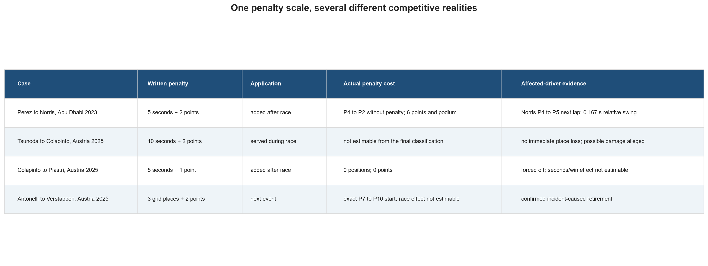
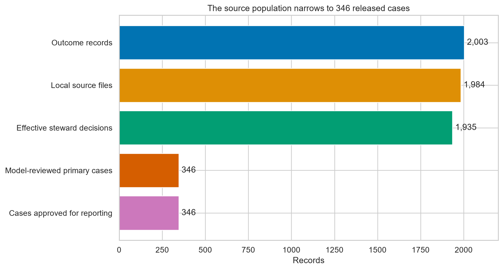
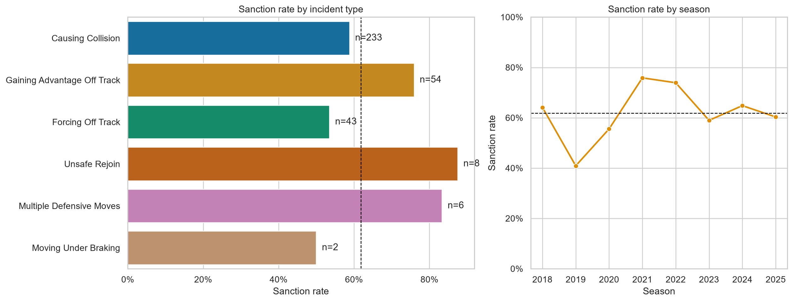
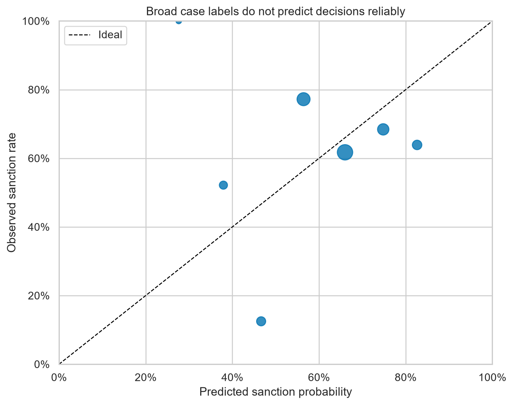
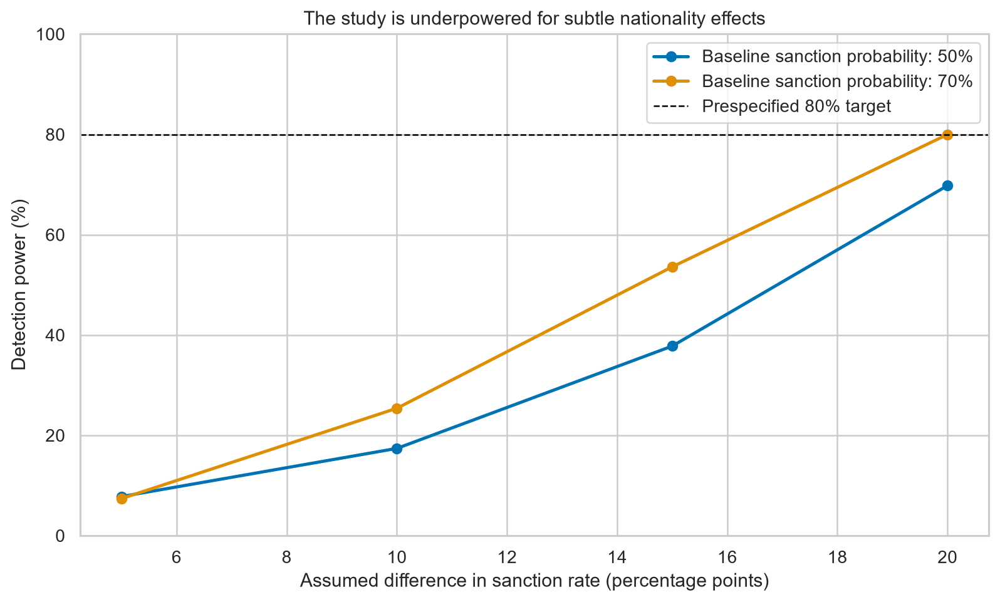

# The Cost of Discretion

## What public FIA data can and cannot show about Formula 1 stewarding, 2018-2025

Read the completed report as an [executable Jupyter notebook](../notebooks/06_final_oversight_report.ipynb)
or a [code-free HTML report](the_cost_of_discretion.html).

### Main finding

The penalty written in a stewarding decision is not always what it costs on track. The report keeps
four facts separate: responsibility, the written penalty, its actual competitive cost, and harm to
the affected driver.

In the independently reviewed pilot, Perez's post-race five-second penalty cost two places, six
points, and a podium. Colapinto's post-race five-second penalty changed no place or points. A served
ten-second penalty changed strategy and traffic, so simply subtracting ten seconds from the final
time would be misleading.

### What the full dataset supports

The evidence system covers all 173 completed events from 2018 through 2025: 9,467 FIA archive
records, 2,003 version-preserving outcome records, 1,984 local source files, and 1,935 effective
steward decisions. The released primary set contains 346 formal Race/Sprint cases across 131 events.

GPT-5.6 Sol completed a disclosed second pass over all 4,441 review obligations. This was a model-led
review of extracted FIA evidence, structured checks, and targeted source inspection—not an
independent human review or a claim that every PDF was reread line by line. The review found 16
unlinked correction/replacement documents and several sanction-field errors. Four unavailable
recalled records remain metadata-only exclusions; no source-unavailable record received an outcome.

Of the 346 cases, 214 received a sanction (61.8%). Rates vary by incident family and season, but
these differences are descriptive and mix case facts, rule changes, mitigation, and referral.

### Consistency result

A grouped model using incident type, season, and multi-car status barely improved over a simple
baseline. Its ROC AUC was 0.558. This does not prove inconsistent stewarding. It shows that broad
case labels do not capture enough decision context to judge consistency or rank supposedly bad
decisions.

### Nationality conclusion

British accused drivers received sanctions in 25 of 44 cases (56.8%), compared with 189 of 302
other-driver cases (62.6%). That raw 5.8-point difference is not an adjusted estimate. With only 44
British-driver cases, the design is underpowered for subtle effects.

The result is **inconclusive**. It is not evidence of either bias or no bias.

### Best ways to strengthen the study

1. Independently audit the highest-risk documents, multi-car cases, and a fresh exclusion sample.
2. Use Race Control messages to study the path from an incident being noted to a formal decision.
3. Compare close source-based case pairs using responsibility, position return, and mitigation.
4. Keep decision consistency separate from harm and penalty cost.
5. Estimate lasting damage on a representative collision sample with clean-lap controls.
6. Keep nationality secondary unless a larger sample can detect a meaningful difference.

### Portfolio evidence

The project uses tested Python, Jupyter, DuckDB SQL, FastF1 enrichment, traceable review records,
Git/CI, and a locally validated Snowflake/Snowsight package. The report explicitly separates
model-reviewed findings from independently human-reviewed pilot evidence.
